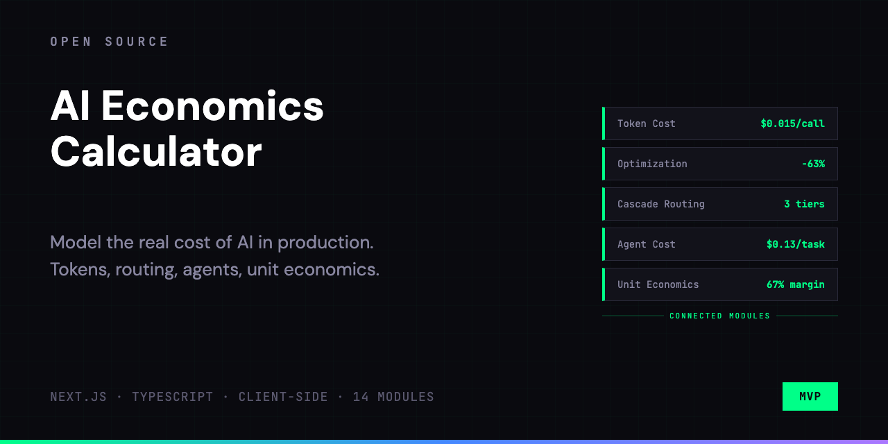
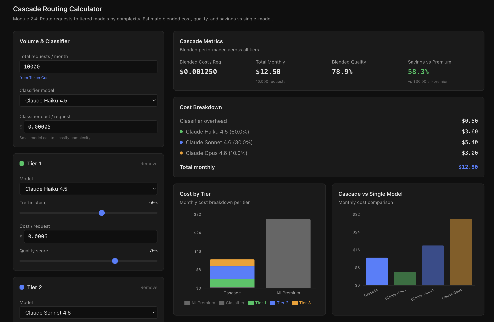

# ai-economics-calculator





**Model AI costs before you ship, not after the invoice arrives.**

An interactive calculator that turns token prices, optimization layers, and routing strategies into monthly costs, gross margins, and launch-ready economics briefs. So PMs can make cost decisions during planning, not after the first AWS bill.

-----

## The Problem

You're planning an AI feature. Engineering says "Claude Sonnet, ~1,500 tokens per request." You nod. Nobody knows what that means at 80K requests/month, across 4 user segments, with caching and routing in the mix.

In practice: the cost model lives in someone's head (or a spreadsheet that's outdated by the time you open it). Nobody stress-tests the margin until post-launch. By then you're either over budget or building optimizations blind.

## What this does

"$0.012 per request" is a number. "$14K/month at 38% gross margin, fixable to 62% with caching + cascade routing" is a decision. This tool turns the first into the second.

1. **Estimate** per-request token costs across models, languages, and pricing modifiers
2. **Stack** optimizations (caching, context trimming, semantic dedup) and watch savings compound
3. **Route** traffic across model tiers and find the cost-quality sweet spot
4. **Model** multi-step agent costs with context growth, tool overhead, and retry rates
5. **Analyze** unit economics per user segment: COGS, margin, AI vs human cost

## Key Insight

The cheapest model is not the cheapest solution. Total cost depends on **how you combine models, caching, and routing**, not on the per-token price alone.

| Strategy | What it optimizes | Typical impact |
|---|---|---|
| Prompt caching | Repeated prefixes (system prompts, few-shot) | 50-90% input cost reduction |
| Semantic cache | Repeated user intents (FAQ, common queries) | 30-60% of traffic served from cache |
| Cascade routing | Model selection by complexity | 40-70% savings vs all-premium |
| Context management | Accumulated context in long conversations | 20-40% input reduction |

Same request volume. Four different cost outcomes. That's what the calculator shows.

-----

## Modules

Five modules, connected by a data pipeline. Each works standalone or pulls data from upstream.

### Token Cost Calculator

Baseline cost estimation. Pick a model, set token counts, apply modifiers (Batch API, prompt caching, extended thinking), choose a language multiplier. See cost per request, monthly cost, and a side-by-side comparison of all models.

### Optimization Stack Simulator

Four compounding optimization layers: output limits, prompt caching, semantic cache, context management. Each layer reduces cost on top of the previous one. Waterfall chart shows where the savings come from.

### Cascade Routing Calculator

Split traffic across 2-4 model tiers by complexity. Configure a classifier model, set traffic shares and quality scores per tier. See blended cost, blended quality, and savings vs routing everything to the premium model.

### Agent Cost Estimator

Multi-step agent economics. Configure up to 15 steps with per-step model selection, tool calls, and token counts. Context accumulates across steps. Supports single-agent and multi-agent (orchestrator + specialists) modes. Shows cost per intent, cost per successful outcome, and context growth charts.

### Unit Economics Dashboard

Fleet-level P&L. Input COGS components (inference, embedding, vector DB, monitoring, fine-tuning), define 2-4 user segments with their own usage patterns, and see gross margin with zone alerts (healthy/monitor/action/critical). Compares AI cost per resolved outcome vs human cost.

-----

## Data Flow

```
Token Cost (2.1)
  |
  +---> Optimization Stack (2.2)
  +---> Cascade Routing (2.4)
  |
  +---> Agent Cost (2.7)
  +---> Unit Economics (2.9)
```

Upstream changes propagate downstream automatically. Any synced field can be overridden manually; a badge shows when source data has changed.

-----

## Worked Example: B2B Support Copilot

A SaaS company handles 80,000 support tickets/month. They're adding an AI copilot to draft responses.

**Baseline (Token Cost):**
- Model: Claude Sonnet 4. Input: 2,000 tokens, output: 500 tokens
- Cost per request: $0.0115
- Monthly: $920

**With Optimization Stack:**
- Prompt caching (system prompt, 85% hit rate): -$280/mo
- Semantic cache (40% FAQ traffic, 70% hit rate): -$258/mo
- Optimized monthly cost: $382. Savings: **58%**

**With Cascade Routing:**
- Tier 1 (Haiku, simple FAQs, 50% traffic): $0.002/req
- Tier 2 (Sonnet, standard tickets, 35%): $0.012/req
- Tier 3 (Opus, escalations, 15%): $0.09/req
- Blended cost: $0.018/req, monthly: $1,440
- vs all-Opus: $7,200/mo. Savings: **80%**

**Unit Economics:**
- COGS per user (2,000 users, 40 tickets/user): $0.46/mo
- Revenue per user: $49/mo
- AI gross margin: **89%**
- Human cost per ticket: $4.20. AI cost per ticket: $0.012. Ratio: **350:1**

One feature, four different cost numbers depending on architecture. That's what the calculator shows.

-----

## Tech Stack

| Tool | Purpose |
|---|---|
| Next.js 16 | App Router, server components |
| TypeScript 6 | Strict mode, typed calculations |
| Recharts 3 | Charts (bar, pie, area, waterfall) |
| Tailwind CSS 4 | Dark theme styling |
| Zustand 5 | Cross-module state management |
| Zod 4 | Input validation |
| Vitest 4 | Unit tests for calculation engine |
| html2canvas | PNG export |

Calculation engine is framework-agnostic: pure functions with no React dependency, fully unit-tested.

-----

## Local Development

```bash
git clone https://github.com/alexe-ev/ai-economics-calculator.git
cd ai-economics-calculator
npm install
npm run dev
```

**Tests:**

```bash
npm test
```

-----

## License

MIT
